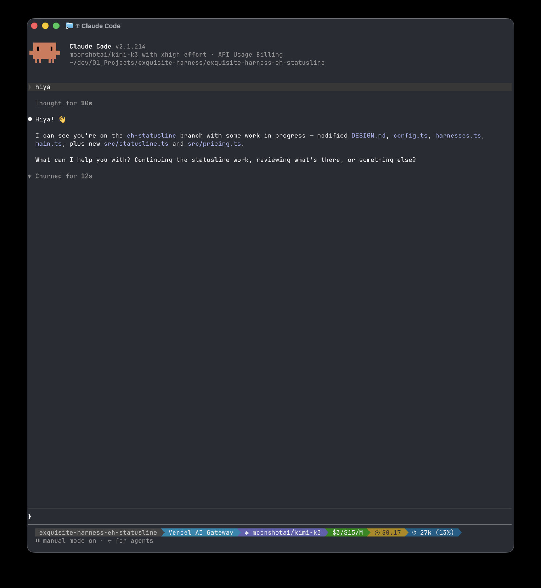

```
                .-----------------------------.
               /       E X Q U I S I T E       \
               '---------------++--------------'
                               ||
                         o\    ||    /o
                         | \   ||   / |
                         o--\--++--/--o
                         |   \ || /   |
                         o----\XX/----o
                         |    /XX\    |
                         o---/ || \---o
                         |  /  ||  \  |
                         o-/---++---\-o
                               ||
               .---------------++--------------.
                \        H A R N E S S        /
                 '---------------------------'
```

**`eh` — pick a harness, pick a provider, go.**

A small CLI that launches the agent harness you want (Claude Code, Codex, Grok
CLI) pointed at the model provider you want (Ollama, OpenRouter, Vercel AI
Gateway) — with the right env vars, args, effort level, and keys wired up for
you. Interactive when you want it, flags when you don't.

## Install

Install the latest self-contained binary with no runtime or GitHub account:

```bash
curl -fsSL https://raw.githubusercontent.com/alephic-ai/exquisite-harness/main/install.sh | bash
```

The installer detects macOS or Linux and arm64 or x64, then installs `eh` to
`~/.local/bin`. Set `EH_INSTALL_DIR` to use another directory. Direct binaries
are also available from
[GitHub Releases](https://github.com/alephic-ai/exquisite-harness/releases). Run
`eh doctor` after installation to check your harnesses, providers, and keys.

No runtime needed — the binary is self-contained. Later, `eh update`
self-updates to the latest public release.



When you launch Claude through `eh`, it injects a session statusline: provider,
model, list rates ($/1M), session cost from real tokens × those rates, and
context % against the provider’s published window — not Claude’s default cost
meter.

## Use it

```bash
eh                                    # interactive: recents, or harness → provider → model
eh claude ollama qwen3-coder          # launch, zero prompts
eh --harness codex -p ollama -m qwen3-coder
                                      # same, with flags (flags win over positionals)
eh cheap-local                        # launch a saved profile
eh claude -p ollama -s cheap-local    # save combo as a profile, then launch
eh --print-env claude ollama qwen3-coder
                                      # print the export lines, don't launch
```

### Effort

```bash
eh claude ollama qwen3-coder -e high  # low|medium|high|xhigh|max (default auto)
```

claude → `CLAUDE_CODE_EFFORT_LEVEL` (+ `CLAUDE_CODE_ALWAYS_ENABLE_EFFORT` for
non-Anthropic providers); codex → `model_reasoning_effort` (`xhigh`/`max` map to
`high`); grok has no knob and ignores it. Profiles and recents remember it.

### Keys

```bash
eh provider key vercel-ai-gateway               # masked prompt → OS credential store
eh provider key vercel-ai-gateway --delete
```

Keys resolve **env → OS credential store → file** (macOS Keychain, Linux Secret
Service via `secret-tool`, `secrets.json` mode `0600` elsewhere). The config
file only ever stores env-var _names_, never secrets. You can also set keys
inline in the picker or via Home → providers.

### Everything else

```bash
eh doctor                             # harnesses installed? providers reachable? keys set?
eh providers                          # provider list + status
eh models ollama                      # live model list (5-min cache)
eh provider add                       # add a custom provider interactively
eh profile save|list|rm               # manage saved combos
eh setup                              # re-run the first-run wizard
eh update                             # self-update to the latest release
```

## The matrix

|             | Ollama | OpenRouter | Vercel AI Gateway |
| ----------- | ------ | ---------- | ----------------- |
| Claude Code | ✅     | ⚠️ router  | ✅                |
| Codex       | ✅     | ✅         | ✅                |
| Grok        | ✅     | ✅         | ✅                |

✅ = native protocol match, launched with env/args only. ⚠️ = needs the phase-2
protocol router (see [DESIGN.md](DESIGN.md)).

## Config

`~/.config/eh/config.json` (`$XDG_CONFIG_HOME/eh`, `%APPDATA%\eh` on Windows) —
providers, profiles, recents. `~/.config/eh/cache.json` — model lists. All three
matrix providers are built in; config only overrides or adds custom ones.

## Developing

Only needed if you're hacking on `eh` itself — users should
[install a release](#install) instead.

```bash
pnpm install
pnpm dev          # run from source (tsx src/main.ts)
pnpm build        # release build: single binary → dist/eh (requires bun)
```

Design doc: [DESIGN.md](DESIGN.md) · QA runbook:
[docs/qa/eh-cli.md](docs/qa/eh-cli.md)
