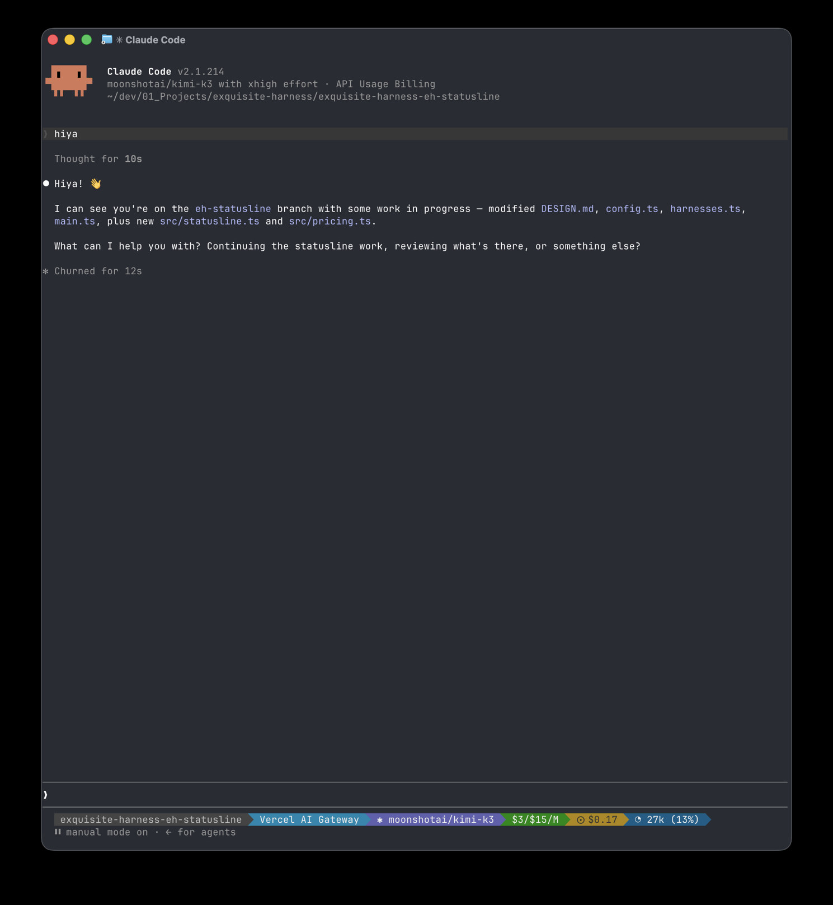

```
                .-----------------------------.
               /       E X Q U I S I T E       \
               '---------------++--------------'
                               ||
                         o\    ||    /o
                         | \   ||   / |
                         o--\--++--/--o
                         |   \ || /   |
                         o----\XX/----o
                         |    /XX\    |
                         o---/ || \---o
                         |  /  ||  \  |
                         o-/---++---\-o
                               ||
               .---------------++--------------.
                \        H A R N E S S        /
                 '---------------------------'
```

**`eh` — pick a harness, pick a provider, go.**

A small CLI that launches the agent harness you want (Claude Code, Codex, Grok
[Build](https://x.ai/cli), opencode, pi) pointed at the model provider you want
(Ollama, OpenRouter, Vercel AI Gateway) — with the right env vars, args, effort
level, and keys wired up for you. Interactive when you want it, flags when you
don't.

## Install

Install the latest self-contained binary with no runtime or GitHub account:

```bash
curl -fsSL https://raw.githubusercontent.com/alephic-ai/exquisite-harness/main/install.sh | bash
```

The installer detects macOS or Linux and arm64 or x64, then installs `eh` to
`~/.local/bin`. Set `EH_INSTALL_DIR` to use another directory. Direct binaries
are also available from
[GitHub Releases](https://github.com/alephic-ai/exquisite-harness/releases). Run
`eh doctor` after installation to check your harnesses, providers, and keys.

No runtime needed — the binary is self-contained. Later, `eh update`
self-updates to the latest public release.



When you launch Claude through `eh`, it injects a session statusline: provider,
model, the selected endpoint's rates when pinned (otherwise the active provider
rate range)
($/1M), session cost, and context %
against the provider’s published window. Vercel AI Gateway and OpenRouter
sessions use exact billed cost metadata. Other totals are token-based estimates
and paid-provider fallbacks carry a `~`; providers with published zero rates
show exact `$0`. Partial or unpriceable totals show `—`
instead of guessing.

OpenCode launches receive the same published rates in their inline model
configuration, so OpenCode's own session-spend display stays populated.

## Use it

```bash
eh                                    # interactive: recents, or harness → provider → model
eh claude ollama qwen3-coder          # launch, zero prompts
eh --harness codex -p ollama -m qwen3-coder
                                      # same, with flags (mixing flags and
                                      # positionals for one slot errors)
eh cheap-local                        # launch a saved profile
eh claude -p ollama -s cheap-local    # save combo as a profile, then launch
eh -r                                 # pick from this dir's sessions (all harnesses)
eh -r codex -p ollama                 # only codex sessions; -p/-m/-e override the wiring
eh claude vercel-ai-gateway anthropic/claude-sonnet-4.6 \
  --gateway-provider bedrock          # pin this run to one Gateway provider
eh claude openrouter anthropic/claude-sonnet-4.6 \
  --gateway-provider anthropic        # same pin on OpenRouter's Anthropic skin
eh --print-env claude ollama qwen3-coder
                                      # print the export lines, don't launch
eh claude ollama qwen3-coder --search firecrawl
                                      # keep Claude's web UX, use Firecrawl
```

### Effort

```bash
eh claude ollama qwen3-coder -e high  # auto|none|minimal|low|medium|high|xhigh|max
```

The picker (and `-e`) only offers levels the harness and the selected model both
accept. claude → `CLAUDE_CODE_EFFORT_LEVEL` (+
`CLAUDE_CODE_ALWAYS_ENABLE_EFFORT` for non-Anthropic providers); codex →
`model_reasoning_effort` (passed through); grok → `--reasoning-effort <level>`
when explicitly set; pi → `--thinking <level>` (levels match 1:1); opencode has
no knob and ignores it. Profiles and recents remember it.

### Approval defaults

Open **Home → defaults → approvals** to choose `platform default` or `auto`.
This is a global, launch-time preference, so changing it immediately affects new
sessions, saved profiles, recent shortcuts, and `eh run` without rewriting any
of them.

| Harness  | `auto` mapping                    |
| -------- | --------------------------------- |
| Claude   | `--permission-mode auto`          |
| Codex    | `--approve-for-me`                |
| Grok     | `--permission-mode auto`          |
| opencode | `--auto`                          |
| pi       | no flag; no tool-approval prompts |

These are the harnesses' native guarded/automatic modes, not unrestricted bypass
flags. Native support still decides whether a mode is available; in particular,
Claude's auto mode may reject unsupported accounts, models, or custom provider
wiring. Pi's separate project-trust `--approve` option is intentionally not
mapped. `platform default` adds no approval argument.

### Upstream provider routing

For OpenRouter and Vercel AI Gateway models, interactive launches offer an
additional provider picker after the model. Each provider row shows its cost ($
in/out per 1M) and p50 throughput (tps). Leave it on `automatic` for normal
routing, pin one upstream with `--gateway-provider <slug>`, or choose `ZDR only`
to restrict routing to zero-data-retention providers. A pin is fail-closed for
that run: the gateway will not fall back to another provider. OpenRouter slugs
may include a path suffix (`deepinfra/turbo`). The option works with Claude,
Codex, Grok, opencode, and pi, plus `eh run`; profiles and recents remember it.
For pi, eh points the harness's native provider at its loopback proxy via a
temporary `--extension`, so no `~/.pi/agent/models.json` mutation is needed.

OpenRouter speaks Anthropic Messages natively (`ANTHROPIC_BASE_URL` is
`https://openrouter.ai/api`), so Claude Code no longer needs the phase-2 router.

### Resume

`eh -r` shows a filterable list of the current directory's sessions across all
harnesses — claude, codex, grok, opencode, and pi — newest first, and resumes
your pick by session id. Each row shows its harness, age, and model when the
store exposes one. Sessions show up whether or not eh launched them; the list
comes from the harnesses' own session stores.

The wiring comes from your recents: the provider that last ran that
harness+model wins, falling back to the latest combo for the harness, then to
the pickers. Add positionals or flags to override — start local, resume on a
gateway model. `eh -r codex` lists only codex sessions.

Resume needs an interactive terminal. For scripts, `eh -r --print-env …` keeps
the old behavior: no picker, prints the env lines plus the harness's bare resume
args (its own picker / most recent). Plans with process-scoped temporary
artifacts cannot be represented safely as exports and instead direct the caller
to launch through eh; this includes Grok's isolated home and Pi Gateway routes.

### Headless runs

`eh ask` is a single-agent delegation wrapper around `eh run`:

```bash
printf 'review this parser for bugs' | eh ask codex ollama qwen3-coder
eh skill print
eh skill install --dir ~/.claude/skills/eh-delegate
```

It reads one prompt from stdin, emits the same versioned NDJSON contract, and
never opens UI, updates recents, or mutates configuration. It supports the
headless options below, including `--reasoning-effort`, `--native-args-json`,
`--gateway-provider`, and `--resume-session`. Installation is idempotent and
refuses to overwrite a differing file unless `--force` is supplied.

`eh run` is the non-interactive execution contract for orchestrators. It reads
one prompt from stdin, runs the selected harness in its native JSON streaming
mode, and writes versioned NDJSON to stdout:

```bash
printf 'fix the parser' |
  eh run codex ollama qwen3-coder --reasoning-effort high
```

Every output object carries `v: 2`. The normalized events are `run.started`,
`session.started`, `assistant.text`, `usage`, `run.error`, and `run.completed`.
Native machine events are preserved as `harness.event`; non-JSON output is
preserved as `harness.output`. Harness stderr remains stderr. A semantically
failed native result makes both `run.completed.exitCode` and the `eh` process
exit code non-zero, even when the child process exits zero.

Per-event `usage` objects carry the harness's own cost estimate (when it reports
one) as `harnessCostUsd`. Before `run.completed`, `eh` emits one final
`cumulative: true` summary `usage` event that adds `costUsd` — the cost `eh`
computes itself from its own accumulated normalized usage times the resolved
model's gateway rates (per-endpoint and tiered when `--gateway-provider` is
pinned) — and `costSource`: `gateway-rates` when computed, `free` for zero-rate
providers such as ollama, or `unavailable` when no rates could be resolved (in
which case `costUsd` is omitted rather than fabricated). Any `harnessCostUsd` is
preserved on the summary too, never promoted to `costUsd`.

#### Exit codes

`eh` owns a small reserved block of exit codes for failures it detects itself;
any other code is the harness's own, passed through unchanged.

| Exit code | Meaning                                                                                                      |
| --------- | ------------------------------------------------------------------------------------------------------------ |
| `0`       | Clean completion                                                                                             |
| `64`      | Preflight/usage error — TTY, empty stdin, invalid flag values, unknown harness/provider; nothing was spawned |
| `65`      | Spawn failure — the harness binary is missing or otherwise unspawnable                                       |
| `66`      | Semantic harness failure — `resultIsError` while the child process exited `0`                                |
| any other | Raw child exit code, passed through unchanged (including `128 + signal` for a signalled child)               |

`run.completed.exitCode` always equals the `eh` process exit code and, in the
passthrough case, carries the raw child code. Because raw codes pass through
untouched, a harness's own exit code may numerically collide with this reserved
block only in the passthrough case; classify from the `run.error` event when the
distinction matters.

The fully specified command never opens UI, updates recents, or installs a
statusline. Claude, Codex, pi, and opencode receive the prompt over stdin; pi
runs with `--mode json`, and opencode uses `run --format json`. Grok receives a
private temporary prompt file because its headless CLI exposes `--prompt-file`;
`eh` removes that file after the child exits. Native session resume is available
for all five harnesses with `--resume-session <id>`. Pass `--cwd <dir>` to run
the spawned harness child in `<dir>`; a missing or non-directory value fails
before launch. Orchestrators that must preserve harness-specific policy flags
can pass a JSON string array with `--native-args-json`; those args are prepended
before `eh`'s required machine-output flags. OpenRouter and Vercel AI Gateway
runs through Claude, Codex, Grok, opencode, or pi may also use
`--gateway-provider <slug>`. Pass `--timeout <seconds>` to fail a hung lane
loudly: on expiry `eh` emits a `run.error` naming the limit, sends `SIGTERM`,
then escalates to `SIGKILL` after a 10s grace period; `run.completed` is still
the final event and a timed-out child exits `143`. Omitting the flag keeps
today's no-deadline behavior.

### Keys

```bash
eh provider key vercel-ai-gateway               # masked prompt → OS credential store
eh provider key vercel-ai-gateway --delete
eh search key firecrawl                         # same storage, separate account
eh search key firecrawl --delete
```

Keys resolve **env → OS credential store → file** (macOS Keychain, Linux Secret
Service via `secret-tool`, `secrets.json` mode `0600` elsewhere). The config
file only ever stores env-var _names_, never secrets. You can also set keys
inline in the picker or via Home → providers.

### Web search and fetch

Claude Code normally fulfills `WebSearch` with an Anthropic server tool, which
breaks when the selected model provider does not implement that tool. `eh` can
keep Claude Code's native tool flow while fulfilling searches and page fetches
through Firecrawl:

```bash
eh search key firecrawl
eh claude vercel-ai-gateway deepseek/deepseek-v4-flash --search firecrawl
```

On an interactive Claude launch, the web-search picker offers Native (the
fallback) and Firecrawl. Home → Providers shows both under Search providers;
choose one and select **make default**. After storing a new Firecrawl key there,
or with `eh search key firecrawl`, `eh` also asks whether to use it by default
for new Claude sessions. Existing Claude recents follow the new default, saved
profiles remain pinned to their saved choice, and `--search` still overrides
everything. Firecrawl's key resolves from `FIRECRAWL_API_KEY` or the same secure
stores used for model providers; `config.json` contains only its env-var name
and endpoint.

This is intentionally a harness-level hack, not MCP. For the life of the Claude
process, `eh` runs a loopback proxy that forwards normal Anthropic traffic to
the chosen model provider and intercepts Claude Code's hidden `web_search_*`
server-tool request. The response uses Anthropic's structured server-tool blocks
so Claude Code reports the real search count and retains the Firecrawl links.

Claude Code executes `WebFetch` locally rather than through the Messages API, so
`eh` also installs process-scoped `PostToolUse` and `PostToolUseFailure` hooks.
They use Firecrawl's official Node SDK to call `POST /v2/scrape`; a successful
native fetch has its model-visible result replaced with Firecrawl markdown,
while a native failure receives the Firecrawl content as recovery context.
Claude's built-in download still happens before the post-tool hook—the hook
controls what the model reads, not the original network request. The SDK is
bundled into the standalone `eh` binary, so users do not install another runtime
or daemon. Both undocumented Claude Code boundaries are covered by loopback
integration tests and may need updating if Claude Code changes them.

### Everything else

```bash
eh doctor                             # harnesses installed? providers reachable? keys set?
eh providers                          # provider list + status
eh models ollama                      # live model list (5-min cache)
eh provider add                       # add a custom provider interactively
eh profile save|list|rm               # manage saved combos
eh setup                              # re-run the first-run wizard
eh update                             # self-update to the latest release
```

## The matrix

|             | Ollama         | OpenRouter | Vercel AI Gateway |
| ----------- | -------------- | ---------- | ----------------- |
| Claude Code | ✅             | ✅         | ✅                |
| Codex       | ✅             | ✅         | ✅                |
| Grok        | ✅             | ✅         | ✅                |
| opencode    | ✅             | ✅         | ✅                |
| pi          | ⚠️ models.json | ✅         | ✅                |

✅ = native protocol match, launched with env/args only. ⚠️ router = needs the
phase-2 protocol router (see [DESIGN.md](DESIGN.md)). pi only talks to providers
in its own catalog or declared in `~/.pi/agent/models.json` — ollama needs an
entry with an API type, API key configuration, base URL, and at least one model
there (eh never writes that file; the picker shows a hint). Keyless local
servers still need a dummy `apiKey` value because Pi uses it as its auth-ready
signal.

## Config

`~/.config/eh/config.json` (`$XDG_CONFIG_HOME/eh`, `%APPDATA%\eh` on Windows) —
providers, profiles, recents, and global defaults. `defaultApprovalMode`
controls launch-time approval behavior. `~/.config/eh/cache.json` — model lists.
All three matrix providers are built in; config only overrides or adds custom
ones. Firecrawl search is also built in; `searchProviders` can override its
`baseURL` or `envKey`, and `defaultSearchProvider` controls new Claude launches.
Saved profiles and recents also include an optional upstream provider pin
(OpenRouter or Vercel AI Gateway).

## Developing

Only needed if you're hacking on `eh` itself — users should
[install a release](#install) instead.

```bash
pnpm install
pnpm dev          # run from source (tsx src/main.ts)
pnpm build        # release build: single binary → dist/eh (requires bun)
```

Design doc: [DESIGN.md](DESIGN.md) · QA runbook:
[docs/qa/eh-cli.md](docs/qa/eh-cli.md)
